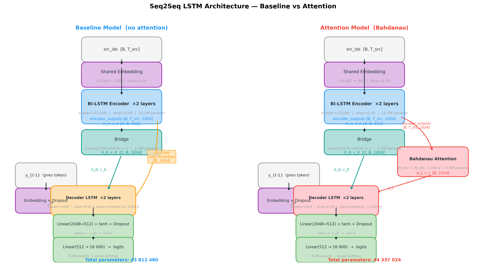
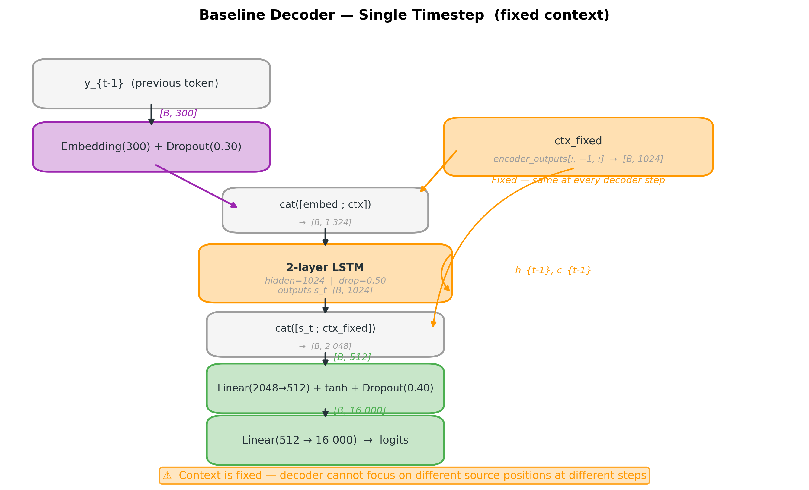
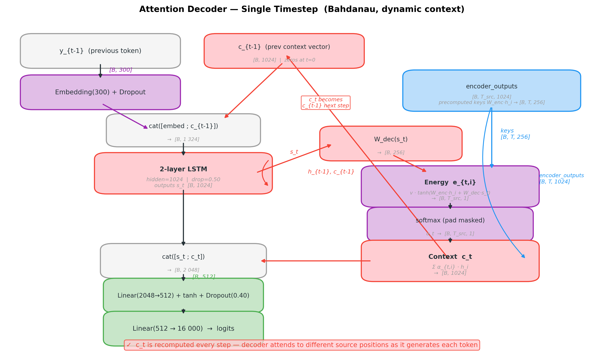
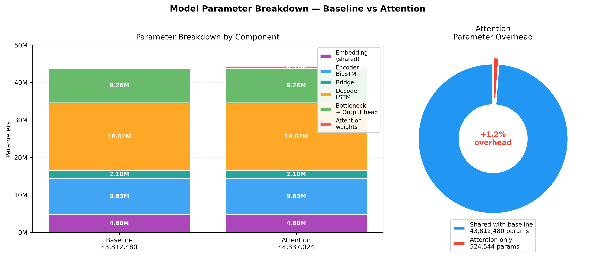
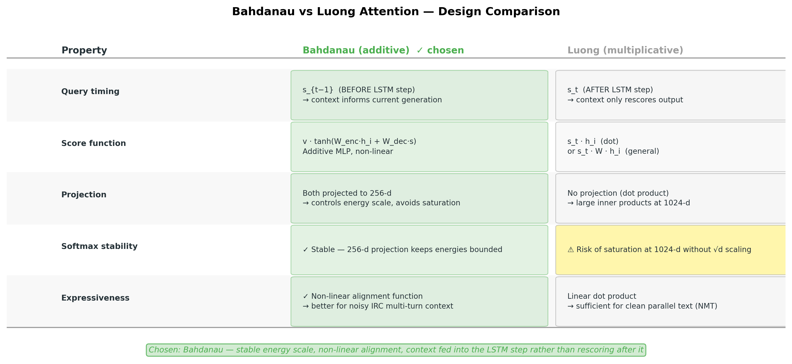

# Model Architecture

Two seq2seq models are trained sequentially on the same dataset and
hyperparameters, differing only in how the decoder consumes encoder
context. This controlled comparison isolates the contribution of
attention.

---

## Shared Components

**Embeddings.** A single `nn.Embedding(16 000, 300)` layer is shared
between encoder and decoder (weight tying). Weights are initialised
from pretrained FastText skip-gram vectors (300-d, 99.99% coverage),
then fine-tuned during training. Embedding dropout: 0.30.

---

## Encoder (shared by both models)

A 2-layer bidirectional LSTM reads the source token sequence and
produces per-timestep hidden states and final states.

*Parameter count: 14 433 792*

---

## Bridge

Projects the bidirectional final states into the decoder's initial
states. Forward and backward layer-pair states are concatenated
(512+512 = 1024) then passed through a linear+tanh projection per
layer, yielding `h_0, c_0` of shape `[2, B, 1024]`.

*Parameter count: 2 099 200*

---

*Figure A1: Side-by-side architecture overview. Both models share the same encoder, bridge, bottleneck, and output head. The only difference is the decoder's context source: a fixed last-timestep vector (baseline) vs a dynamically recomputed Bahdanau attention vector (attention).*

---

## Decoder — Baseline (no attention)

The context is fixed: the last encoder timestep `encoder_outputs[:, −1, :]`
is concatenated to every embedded input token and held constant
throughout decoding.

*Parameter count: 32 079 488* — the `Linear(512→16 000)` output head
accounts for 8.2 M; the 2048→512 bottleneck avoids a costly direct
2048×16 000 projection (would add 24 M parameters).

*Figure A2: Baseline decoder at one timestep. The orange ctx\_fixed vector (encoder last timestep) is concatenated to the embedded input before the LSTM and again after, then passed through the bottleneck projection to logits. It never changes — the decoder has no mechanism to focus on different source positions.*

---

## Decoder — Attention (Bahdanau additive)

Identical to baseline except the context vector `c_t` is **recomputed
at every step** as a weighted sum over all encoder outputs.

Attention projection dimensions: W_enc and W_dec both map to **256**,
keeping the energy computation lightweight (attn_dim = 256).

*Figure A3: Attention decoder at one timestep. The right-hand column (purple/red) shows the Bahdanau mechanism: W\_dec(s\_t) and precomputed W\_enc(h\_i) keys combine to produce per-position energies, softmax normalises them to α\_t, and the weighted sum over encoder outputs gives c\_t. Crucially, c\_t is carried back as c\_{t-1} for the next step, and the LSTM receives the previous c\_t concatenated with the embedded token as its input — context informs generation before the recurrent step.*

---

## Parameter Summary

Notation: LSTM layer params = `4H(I + H) + 8H` where I = input size, H = hidden size.
Embedding shared between encoder and decoder; counted once in the total.

### Encoder — 14 433 792

| Sub-component | Calculation | Params |
|---|---|---:|
| Embedding (shared) | 16 000 × 300 | 4 800 000 |
| BiLSTM L1 (×2 dirs) | 2 × [4×512×(300+512) + 8×512] | 3 334 144 |
| BiLSTM L2 (×2 dirs) | 2 × [4×512×(1024+512) + 8×512] | 6 299 648 |
| **Encoder total** | | **14 433 792** |

### Bridge — 2 099 200

| Sub-component | Calculation | Params |
|---|---|---:|
| h_projection | 1024×1024 + 1024 | 1 049 600 |
| c_projection | 1024×1024 + 1024 | 1 049 600 |
| **Bridge total** | | **2 099 200** |

### Decoder — Baseline 32 079 488 · Attention 32 604 032

| Sub-component | Calculation | Baseline | Attention |
|---|---|---:|---:|
| Embedding (ref, shared) | 16 000 × 300 | 4 800 000 | 4 800 000 |
| LSTM L1 | 4×1024×(1324+1024) + 8×1024 | 9 625 600 | 9 625 600 |
| LSTM L2 | 4×1024×(1024+1024) + 8×1024 | 8 396 800 | 8 396 800 |
| Attn W_enc | 1024×256 (bias=False) | — | 262 144 |
| Attn W_dec | 1024×256 (bias=False) | — | 262 144 |
| Attn v | 256×1 (bias=False) | — | 256 |
| Proj Linear | 2048×512 + 512 | 1 049 088 | 1 049 088 |
| Output Linear | 512×16 000 + 16 000 | 8 208 000 | 8 208 000 |
| **Decoder total** | | **32 079 488** | **32 604 032** |

### Grand Total (embedding counted once)

| Model | Calculation | Total |
|---|---|---:|
| Baseline | 4 800 000 + 9 633 792 + 2 099 200 + 18 022 400 + 9 257 088 | **43 812 480** |
| Attention | Baseline + 262 144 + 262 144 + 256 | **44 337 024** |

The attention mechanism adds only **524 544 parameters (<1.2% overhead)**
while giving the decoder full dynamic access to all encoder states.

*Figure A4: Left — stacked bar showing contribution of each component to total parameter count (Embedding 4.8M, Encoder BiLSTM 9.6M, Bridge 2.1M, Decoder LSTM 18.0M, Bottleneck+Output 9.3M). Right — donut showing the attention overhead (524,544 params) is only 1.2% of the total 44.3M.*

---

## Weight Initialisation

| Layer type | Init |
|---|---|
| `nn.Linear` | Xavier uniform; bias = 0 |
| LSTM `weight_ih` | Xavier uniform |
| LSTM `weight_hh` | Orthogonal (Saxe 2013) |
| LSTM forget-gate bias | 1.0 (Jozefowicz 2015) |
| Embedding | Pretrained FastText (not reset) |

---

# Appendix

## A. Glossary of Key Terms

| Term | Definition |
|---|---|
| **Seq2Seq** | Encoder–decoder architecture mapping a variable-length input sequence to a variable-length output sequence |
| **BiLSTM** | Bidirectional LSTM — runs two LSTMs in opposite directions over the input; each position sees both past and future context |
| **Hidden state h** | LSTM recurrent memory vector propagated across timesteps; encodes sequence history |
| **Cell state c** | LSTM long-term memory; gated separately from h; mitigates vanishing gradient |
| **Bridge** | Linear projection mapping encoder final states to decoder initial states; necessary because encoder is bidirectional (dim 512×2) while decoder is unidirectional (dim 1024) |
| **Teacher forcing** | During training, feeding the ground-truth previous token as decoder input instead of the model's own prediction; accelerates convergence but creates exposure bias |
| **Exposure bias** | Train/inference mismatch: model trained with teacher forcing but must use its own outputs at inference time |
| **Bahdanau attention** | Additive attention (Bahdanau et al., 2015); energy computed as `v·tanh(W_enc·h_i + W_dec·s_t)`; allows soft alignment between decoder state and all encoder positions |
| **Context vector c_t** | Weighted sum of encoder outputs; attention weights α_t determine contribution of each source position |
| **BPE / SentencePiece** | Byte-Pair Encoding tokeniser; splits rare words into subword units; vocabulary bounded to 16 000 tokens |
| **Perplexity (PPL)** | `exp(cross-entropy loss)`; measures how surprised the model is by the validation set; lower is better |
| **Bottleneck projection** | `Linear(2048→512)` before the output head; reduces parameters from 32.8 M to 8.2 M for the final projection |
| **Weight tying** | Encoder and decoder share a single embedding matrix; reduces parameters by 4.8 M and improves generalisation |
| **Orthogonal init** | LSTM recurrent weights initialised as orthogonal matrices; preserves gradient norms through time |
| **Forget-gate bias = 1** | Initialising LSTM forget-gate bias to 1.0 encourages the network to remember inputs early in training (Jozefowicz et al., 2015) |

---

## B. Formal Equations

### B.1 LSTM Cell (single layer, single direction)

$$
\begin{aligned}
i_t &= \sigma(W_{ii} x_t + b_{ii} + W_{hi} h_{t-1} + b_{hi}) \\
f_t &= \sigma(W_{if} x_t + b_{if} + W_{hf} h_{t-1} + b_{hf}) \\
g_t &= \tanh(W_{ig} x_t + b_{ig} + W_{hg} h_{t-1} + b_{hg}) \\
o_t &= \sigma(W_{io} x_t + b_{io} + W_{ho} h_{t-1} + b_{ho}) \\
c_t &= f_t \odot c_{t-1} + i_t \odot g_t \\
h_t &= o_t \odot \tanh(c_t)
\end{aligned}
$$

Parameter count per layer: `4H(I + H) + 8H`
where I = input size, H = hidden size, the factor 4 covers {i, f, g, o} gates,
and 8H covers four bias vectors (ih + hh).

### B.2 Bahdanau Attention

$$
e_{t,i} = \mathbf{v}^\top \tanh\!\left(W_{\text{enc}}\, h_i + W_{\text{dec}}\, s_t\right)
$$

$$
\alpha_{t,i} = \frac{\exp(e_{t,i})}{\sum_j \exp(e_{t,j})} \quad \text{(padding masked to } {-\infty}\text{)}
$$

$$
c_t = \sum_i \alpha_{t,i}\, h_i
$$

Dimensions: W_enc ∈ ℝ^{256×1024}, W_dec ∈ ℝ^{256×1024}, v ∈ ℝ^{256×1}

**Optimisation:** `W_enc(encoder_outputs)` is precomputed once before the
decode loop (cost: B × T_src × 1024 × 256), eliminating T_resp redundant
matrix multiplications.

### B.3 Output Projection (both decoders)

$$
\hat{y}_t = W_{\text{out}}\,\tanh\!\left(W_{\text{proj}}\,\left[s_t;\, c_t\right]\right)
$$

where `[s_t ; c_t] ∈ ℝ^{2048}`, W_proj ∈ ℝ^{512×2048}, W_out ∈ ℝ^{16000×512}.

### B.4 Training Loss

$$
\mathcal{L} = -\frac{1}{N} \sum_{n=1}^{N} \sum_{t=1}^{T} \mathbf{1}[y_t \neq \texttt{<pad>}] \cdot \log p(y_t \mid y_{<t}, X)
$$

Padding positions are masked before reduction. Label smoothing = 0.0 (off).

---

## C. Full Forward-Pass Flow Diagrams

### C.1 Baseline — Complete Forward Pass

See Figure A1 (overview) and Figure A2 (single decoder timestep) for the full data flow. The key operational sequence is:

1. **Encoder**: `src_ids → Embedding → BiLSTM ×2` → `encoder_outputs [B, T_src, 1024]` and `h_n, c_n [4, B, 512]`
2. **Bridge**: concatenate fwd/bwd final states per layer → `Linear(1024→1024) → tanh` → `h_0, c_0 [2, B, 1024]`
3. **Decoder loop** (T_trg steps): `ctx_fixed = encoder_outputs[:, −1, :]` (constant), each step: `cat([embed, ctx_fixed]) → LSTM → cat([s_t, ctx_fixed]) → bottleneck → logits`
4. **Loss**: padded cross-entropy over `logits [B, T_trg, 16000]`

### C.2 Attention — Differences from Baseline

See Figure A3 for the single-step attention data flow. The attention additions relative to the baseline (marked `>>>`) are:

- `>>> keys = W_enc(encoder_outputs) [B, T_src, 256]` — precomputed once before the loop
- `>>> c_prev = zeros [B, 1024]` — initialised before the loop, carried forward each step
- Each step: `embed` concatenated with `c_prev` (not `ctx_fixed`) as LSTM input
- `>>> query = W_dec(h[-1]) → [B, 256]`
- `>>> energy = v(tanh(keys + query.unsqueeze(1))) → [B, T_src, 1]` then pad-masked and softmaxed to `α_t`
- `>>> c_t = (α_t × encoder_outputs).sum(dim=1) → [B, 1024]`
- `c_prev = c_t` at end of each step

---

## D. Design Decisions and Rationale

**Why bidirectional encoder but unidirectional decoder?**  
The encoder reads a *complete* context sequence — bidirectionality allows
each position to attend to both past and future tokens, producing richer
representations. The decoder generates tokens *autoregressively* (one at a
time, left to right), so future tokens are unavailable; bidirectionality
is inapplicable.

**Why the 2048→512 bottleneck before the output head?**  
A direct `Linear(2048, 16 000)` would cost 32.8 M parameters — 75% of the
entire baseline model — for a single projection. The bottleneck reduces this
to 1.05 M + 8.21 M = 9.26 M (72% saving) with a tanh non-linearity that
also enriches the representation before vocabulary scoring.

**Why shared embeddings?**  
Source and target are in the same language (English). Sharing the 4.8 M
embedding matrix enforces consistent token representations across encoder
and decoder, reduces parameters, and has been shown to improve translation
quality in same-language seq2seq tasks (Press & Wolf, 2017).

**Why attn_dim = 256 (not 512 or 1024)?**  
The attention energy computation is a bottleneck projection: projecting both
encoder and decoder states to a lower-dimensional space before computing
compatibility. 256 dimensions empirically balances expressiveness against
the cost of computing attention over T_src positions at every decoder step.

**Why Bahdanau attention and not Luong attention?**  
The two mechanisms differ in three fundamental ways:

*Figure A5: Side-by-side comparison of the two attention mechanisms across five design dimensions. Green cells indicate the Bahdanau advantage; the yellow cell highlights the Luong softmax saturation risk at 1024-d without explicit √d scaling.*

Four reasons drove the choice of Bahdanau for this model:

1. **Avoids softmax saturation.** Luong dot-product computes
   `s_t · h_i` where both vectors are 1024-dimensional. Large inner
   products push the softmax into near-zero-gradient regions, making
   alignment learning slow. Bahdanau projects both to 256-d before
   scoring, keeping energy values in a stable range without needing
   explicit scaling (cf. the √d scaling added in Transformers for
   exactly this reason).

2. **More expressive alignment.** The additive MLP
   `v·tanh(W_enc·h_i + W_dec·s)` learns a non-linear compatibility
   function. For technical IRC chat — where a short question may align
   to a specific command token buried in a long multi-turn context —
   this extra expressiveness matters more than for clean parallel text.

3. **Cleaner information flow.** Bahdanau attends using `s_{t-1}`
   (the state *before* the current step), so the context vector
   informs what the LSTM should compute next. Luong attends using
   `s_t` (the state *after* the LSTM step), meaning the LSTM runs
   first without seeing the context — the context only rescores the
   output. For generation tasks, attending before the recurrent step
   aligns better with how humans read context before formulating a reply.

4. **Consistent with published seq2seq chatbot baselines.** The
   Ubuntu Dialogue Corpus benchmarks (Lowe et al., 2015; Shang et al.,
   2015) predominantly use additive attention, making results directly
   comparable. Luong attention is more common in NMT literature where
   the dot-product efficiency matters at large scale — less relevant
   here at 44 M parameters on a single GPU.

**Why no layer normalisation or residual connections?**  
The model is deliberately compact (44 M parameters) and LSTM-based. Layer
norm and residuals are most impactful in very deep or Transformer
architectures where gradient flow is the primary challenge. For 2-layer
LSTMs, orthogonal init + forget-gate bias = 1 adequately addresses gradient
flow, and adding norm layers would increase training complexity without
clear benefit at this scale.

