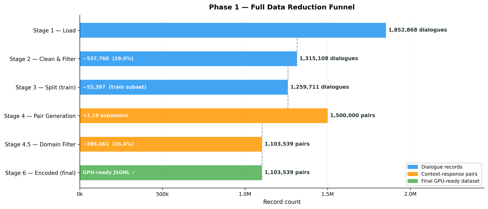
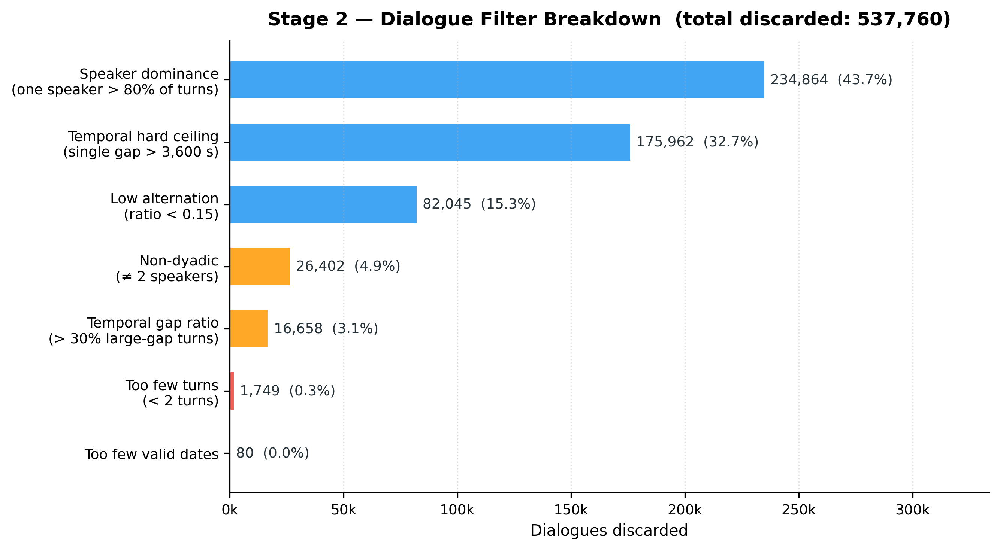
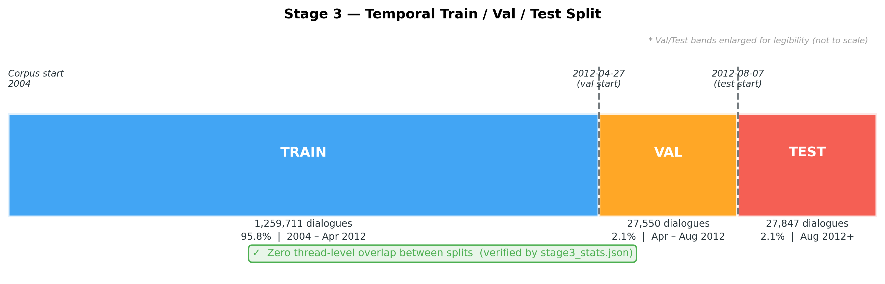
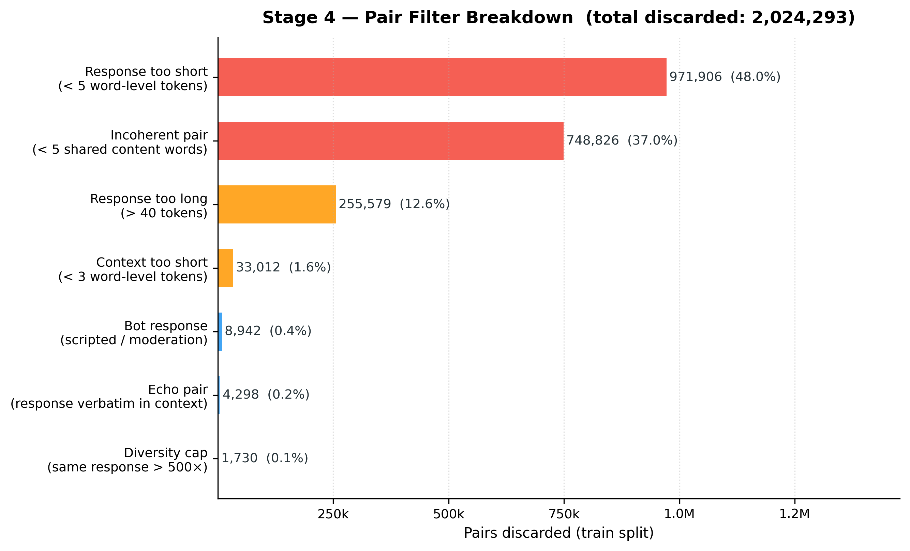
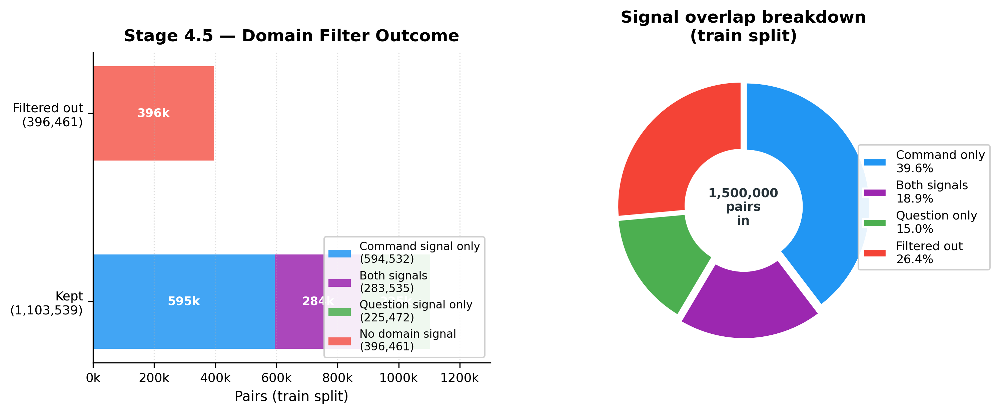
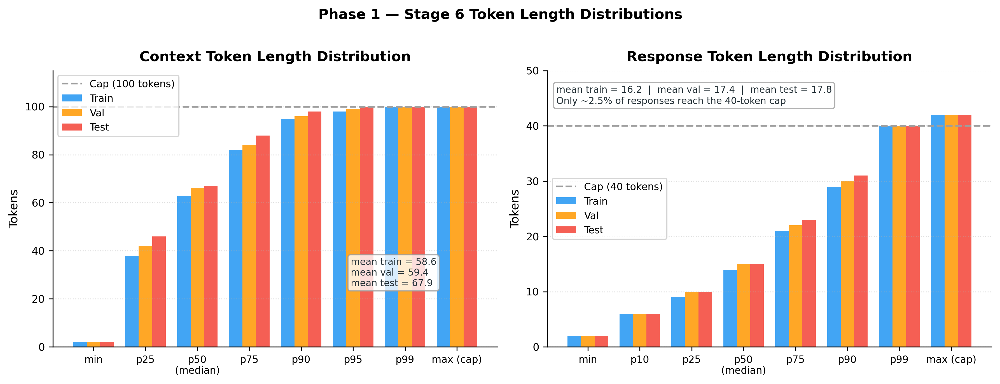

# Phase 1: Data Preprocessing Pipeline

**Project:** NLP Seq2Seq LSTM Chatbot  
**Corpus:** Ubuntu Dialogue Corpus (Lowe et al., 2015) — ~3.7 M raw IRC dialogues  
**Script:** `phase1.py` (1,758 lines)  
**Hardware:** RTX 3080 12 GB, AMD Ryzen 7 5700X, Windows 11

---

## Overview

Phase 1 transforms raw IRC log CSV files into GPU-ready integer tensors in eight sequential stages. Each stage writes a named artifact to `artifacts/`, so any single stage can be re-run without reprocessing the whole corpus. The pipeline is deterministic: every random operation uses `seed=42`.

```
CSV files (data/)
     │  Stage 1 — Load corpus
     ▼
stage1_dialogues.pkl          1,852,868 dialogues  (1,700 MB)
     │  Stage 2 — Clean & filter
     ▼
stage2_clean_dialogues.pkl    1,315,108 dialogues  (1,119 MB)  71.0% kept
     │  Stage 3 — Temporal split
     ▼
stage3_{train,val,test}.pkl   1,259,711 / 27,550 / 27,847      95.8 / 2.1 / 2.1%
     │  Stage 4 — Generate (ctx, resp) pairs
     ▼
stage4_{train,val,test}_pairs.json   1,500,000 / 63,258 / 63,822 pairs  (712 MB)
     │  Stage 4.5 — Domain filter (union: command OR question)
     ▼
stage4_5_{train,val,test}_pairs.json 1,103,539 / 47,244 / 47,377 pairs  (565 MB)
     │  Stage 5 — Train SentencePiece BPE
     ▼
stage5_spm.model + .vocab             16,000-token vocabulary  (0.72 MB)
     │  Stage 6 — Encode pairs → token ID arrays
     ▼
stage6_{train,val,test}_ids.jsonl     1,103,539 / 47,244 / 47,377 JSONL (490 MB)
     │  Stage 7 — Train FastText skip-gram on BPE tokens
     ▼
stage7_fasttext.model                 300-dim subword vectors  (2,326 MB)
     │  Stage 8 — Build embedding matrix
     ▼
stage8_embedding_matrix.npy           [16,000 × 300] float32   (18.31 MB)
```

Each artifact is checksummed via the stage stats JSON files and can serve as a restart point. Stage 4.5 (domain filter) is optional and controlled by `domain_filter=True` in `config.py`; when disabled the pipeline feeds Stage 4 output directly to Stage 5.

The total funnel reduces 1,852,868 raw dialogues to **1,103,539 training pairs** — a retention path of 59.6 % measured at the pair level.



*Figure P1: Each bar represents the record count at the output of that stage. Blue = dialogue records; orange = context-response pairs; green = final GPU-ready dataset. Discard counts and percentages are shown inside each bar.* Every discarded item is counted, categorised, and written to the companion `*_stats.json` file for audit.

Tokenisation uses **Byte Pair Encoding** (Sennrich et al., 2016) via SentencePiece, giving zero out-of-vocabulary (UNK) rate on the training corpus. Embeddings are warm-started from **FastText skip-gram** (Bojanowski et al., 2017) vectors trained on the BPE-tokenised corpus itself, achieving 99.99 % vector coverage (15,999 / 16,000 rows; the single unfilled row is `<pad>`, intentionally zeroed).

The output contract is strict: every context sequence is a right-truncated integer array (last 100 tokens), every response is `[<sos>, t₁, …, tₙ, <eos>]`. This contract is verified programmatically by `analyze_data.py` before training begins.

---

## Summary Table

| Stage | Input | Output | Records in | Records out | Retention |
|---|---|---|---|---|---|
| 1 — Load | CSV files | `stage1_dialogues.pkl` | — | 1,852,868 dlg | — |
| 2 — Clean | Stage 1 | `stage2_clean_dialogues.pkl` | 1,852,868 | 1,315,108 dlg | 71.0% |
| 3 — Split | Stage 2 | `stage3_{train,val,test}.pkl` | 1,315,108 | 1,315,108 dlg | 100% |
| 4 — Pairs | Stage 3 | `stage4_*_pairs.json` | 1,315,108 dlg | 1,627,080 pairs | — |
| 4.5 — Filter | Stage 4 | `stage4_5_*_pairs.json` | 1,627,080 | 1,198,160 pairs | 73.6% |
| 5 — BPE | Stage 4.5 | `stage5_spm.model` | 1,103,539 train | 16,000 tokens | — |
| 6 — Encode | Stage 5 | `stage6_*_ids.jsonl` | 1,198,160 | 1,198,160 pairs | 100% |
| 7 — FastText | Stage 6 | `stage7_fasttext.model` | all pairs | 300-dim vecs | — |
| 8 — Embed | Stage 7 | `stage8_embedding_matrix.npy` | 16,000 tokens | 15,999 vectors | 99.99% |

---

## Appendix A — Stage-by-Stage Technical Reference

### A.1 Stage 1 — Load Corpus

**Function:** `stage1_load_corpus(cfg)`  
**Input:** All CSV files under `data/Ubuntu-dialogue-corpus/`  
**Output:** `artifacts/stage1_dialogues.pkl` (1,700 MB)

Each CSV row contains `dialogueID`, `folder`, `date`, `from`, `text`. Rows are grouped by the composite key `folder/dialogueID` and sorted by UTC timestamp within each group, producing a list of dialogue dicts:

```python
{"id": "folder/id",
 "turns": [{"date": datetime, "from": str, "text": str}, ...]}
```

`csv.field_size_limit(2**24)` is set to allow large pasted blocks. No filtering occurs at this stage — all 1,852,868 dialogues are preserved exactly as loaded.

---

### A.2 Stage 2 — Clean and Filter

**Function:** `stage2_clean_and_filter(dialogues, cfg)`  
**Input:** Stage 1 pkl  
**Output:** `artifacts/stage2_clean_dialogues.pkl` (1,119 MB), `stage2_stats.json`  
**Parallelism:** `multiprocessing.Pool` (spawn context) across dialogue batches

#### Per-turn operations (`_filter_dialogue`, `_clean_text`)

1. **Bot speaker removal** — turns from known IRC bots (`_BOTS`: ubottu, ubotu, chanserv, …) are dropped entirely
2. **IRC action removal** — `/me …` emote lines removed
3. **Paste detection** (`_is_likely_paste`) — turns dropped if: alpha ratio < 0.30 AND special-char density > 0.15 AND colon count ≥ 3
4. **Repetition filter** — turns dropped if a single token accounts for > 50 % of all tokens
5. **`_clean_text` normalisation pipeline** (applied to every surviving turn):
   - Lowercase
   - Contraction expansion: `can't` → `cannot`, `won't` → `will not`, etc. (28 rules)
   - URL masking: `_RE_URL` → `__url__`
   - Path masking: `_RE_PATH` (≥ 2 path segments) → `__path__`
   - IP masking: `_RE_IP` → `__ip__`
   - Number normalisation: standalone numerals → `__number__`
   - Non-alpha strip: `_RE_NONALPHA = r"[^a-z0-9 '\-_.]+"` (removes all punctuation incl. `?`)
   - Whitespace collapse

#### Per-dialogue filters

| Filter | Threshold | Discard count | % of input |
|---|---|---|---|
| Minimum turns | ≥ 2 turns | — | — |
| Dyadic only | Exactly 2 speakers | — | — |
| Speaker dominance | One speaker ≤ 80% of turns | 234,864 | 12.7% |
| Hard gap ceiling | No single turn gap > 3,600 s | 175,962 | 9.5% |
| Low alternation | Alternation ratio ≥ 0.15 | 82,045 | 4.4% |
| Soft gap ratio | Large-gap (> 600 s) turns ≤ 30% | — | — |

**Result:** 1,315,108 dialogues kept (71.0%)



*Figure P2: Contribution of each Stage 2 filter to the 537,760 discarded dialogues. Speaker dominance (43.7%) and temporal hard ceiling (32.7%) together account for three-quarters of all discards.*

---

### A.3 Stage 3 — Temporal Split

**Function:** `stage3_temporal_split(dialogues, cfg)`  
**Output:** `stage3_{train,val,test}.pkl`, `stage3_stats.json`

Dialogues are assigned to splits by their **first-turn UTC date**. No dialogue spans two splits, guaranteeing zero thread-level leakage. Overlap assertions are hard-coded and fail-fast.

| Split | Date range | Dialogues | % |
|---|---|---|---|
| Train | 2004 – 2012-04-27 | 1,259,711 | 95.8% |
| Val | 2012-04-27 – 2012-08-07 | 27,550 | 2.1% |
| Test | 2012-08-07 onwards | 27,847 | 2.1% |

**Why temporal, not random?** A random split would allow the model to train on conversations from the same week as validation examples, inflating val metrics and failing to simulate real deployment (always predicting on future text). The temporal split enforces true generalisation over time.



*Figure P6: Val/test bands are enlarged for legibility (not to scale). Zero thread-level overlap was confirmed programmatically — no dialogue ID appears in more than one split.*

---

### A.4 Stage 4 — Generate Context-Response Pairs

**Function:** `stage4_generate_pairs(train_dlg, val_dlg, test_dlg, cfg)`  
**Output:** `stage4_*_pairs.json`, `stage4_*_samples.txt`, `stage4_stats.json`

For each dialogue, consecutive same-speaker turns are first merged (`_merge_same_speaker_turns`). Then for each turn `i` designated as the response, the preceding `max_ctx_turns=8` turns are concatenated with `__eot__` separators to form the context:

```
turn_{i-k} __eot__ ... __eot__ turn_{i-2} __eot__ turn_{i-1}   →  ctx
turn_i                                                           →  resp
```

IRC speaker handles matching `[\d_\-\[\]\\^{}|]` or length > 9 are replaced with `__user__`. The 11 known IRC bot names (including possessive forms like `ubottu's`) are also replaced with `__user__` via `_RE_BOT_NAMES`.

#### Pair-level filters applied to every generated pair

| Filter | Rule | Discards (train) | % of raw |
|---|---|---|---|
| Min response length | `min_resp_tokens=5` (word-level) | 971,906 | 27.6% |
| Coherence (`filter_incoherent_pairs`) | Last substantive ctx turn AND resp share ≥ 5 content words (non-stopwords, ≥ 4 chars) | 748,826 | 21.2% |
| Max response length | `max_resp_tokens=40` | 255,579 | 7.3% |
| Bot response blacklist | 28 regex patterns (scripted/moderation responses) | — | — |
| Echo pairs | Response verbatim in context | — | — |
| Placeholder-only | Response is only `__url__`/`__path__`/`__ip__` | — | — |
| Non-English | Response ASCII ratio < 80% | — | — |
| Diversity cap | Same response text seen > 500× (train only) | 1,730 | 0.05% |

After filtering, train pairs are randomly shuffled and capped at `max_train_pairs=1,500,000`. A sample of 200 pairs is written to `stage4_train_samples.txt` for manual inspection.



*Figure P3: Response-too-short (48.0%) and incoherent-pair (37.0%) filters account for 85% of all pair discards, reflecting the noisy nature of raw IRC dialogue. All other filters are minor by comparison.*

---

### A.5 Stage 4.5 — Domain Filter

**Function:** `stage4_5_domain_filter(train_pairs, val_pairs, test_pairs, cfg)`  
**Config:** `domain_filter=True`, `domain_filter_strategy="union"`  
**Output:** `stage4_5_*_pairs.json`, `stage4_5_filter_stats.json`

Retains pairs matching **Strategy A** (command/path signal) OR **Strategy B** (question pattern). The union avoids the over-restrictive intersection (~300k) while still removing chit-chat noise.

#### Strategy A — Command filter (`_DOMAIN_CMD_RE`)

```
\b(sudo|apt-get|apt|dpkg|snap|chmod|chown|grep|cat|ls|mkdir|rm|cp|mv|
   wget|curl|tar|ssh|df|du|kill|mount|umount|pip|nano|vim|vi|sed|awk|
   find|locate|ps|top|ping|service|systemctl|ufw|crontab|adduser|passwd|
   netstat|ifconfig|export|echo|source|make|gcc)\b
```

OR `"__path__"` present in ctx or resp (already-masked filesystem references).

> **Critical design note:** `?` is stripped by `_RE_NONALPHA` in Stage 2. All question-pattern matching must therefore be punctuation-free. Commands are NOT replaced by `__cmd__` (the token is reserved but never substituted) — they survive `_clean_text` intact.

#### Strategy B — Question filter (`_DOMAIN_Q_PATTERNS`, last substantive context turn)

```
how (do|can|to) (i|you|we)    what (is|are|does|do)
where (is|are|can|do)          why (is|does|do)
cannot                         problem|error|fail|broken|issue|not working
i (need|want|am trying) to     anyone|anybody know
is (is|can|do|will|does)\b
```

Only the **last 1–2 substantive turns** (≥ 4 words) of the context are scanned — scanning all turns would match questions asked several exchanges ago, pairing them with off-topic recent replies.

#### Results

| Split | Before | After | Kept |
|---|---|---|---|
| Train | 1,500,000 | 1,103,539 | 73.6% |
| Val | 63,258 | 47,244 | 74.7% |
| Test | 63,822 | 47,377 | 74.2% |



*Figure P4: Left — stacked bar showing the composition of kept pairs (command-only, both signals, question-only) vs filtered-out pairs. Right — donut chart showing the proportion of each signal category across all 1.5M input pairs. The union strategy retains 73.6% while requiring at least one domain signal.*

---

### A.6 Stage 5 — SentencePiece BPE Training

**Function:** `stage5_train_spm(train_pairs, cfg)`  
**Output:** `stage5_spm.model` (0.48 MB), `stage5_spm.vocab` (0.24 MB)

The BPE model is trained exclusively on Stage 4.5 **train** pairs. Val and test are never seen during vocabulary construction, preventing test-set leakage into the token distribution. All ctx and resp text is written to a temporary corpus file, then:

```python
sentencepiece.SentencePieceTrainer.train(
    input        = corpus_file,
    model_type   = "bpe",
    vocab_size   = 16000,
    pad_id=0,  unk_id=1,  bos_id=2,  eos_id=3,
    pad_piece="<pad>",  unk_piece="<unk>",
    bos_piece="<sos>",  eos_piece="<eos>",
    user_defined_symbols = [
        "__url__","__path__","__ip__","__cmd__",
        "__number__","__eot__","__user__"
    ],
    character_coverage       = 0.9999,
    input_sentence_size      = 2_000_000,
    shuffle_input_sentence   = True,
)
```

The `user_defined_symbols` list guarantees all seven domain tags are assigned **single token IDs** (IDs 4–10 in order). Without this, BPE might segment `__eot__` into `_`, `_`, `eot`, `_`, `_` — producing four gradient signals instead of one.

#### Token ID contract

| ID | Token | Role |
|---|---|---|
| 0 | `<pad>` | Padding — zero vector, no gradient |
| 1 | `<unk>` | Out-of-vocabulary fallback (0.000% in practice) |
| 2 | `<sos>` | Decoder seed — injected at start of every response |
| 3 | `<eos>` | Generation stop signal |
| 4 | `__url__` | Masked URL |
| 5 | `__path__` | Masked filesystem path |
| 6 | `__ip__` | Masked IP address |
| 7 | `__cmd__` | Reserved (never generated by `_clean_text`) |
| 8 | `__number__` | Masked standalone numeral |
| 9 | `__eot__` | End-of-turn separator (multi-turn context) |
| 10 | `__user__` | Masked IRC handle or bot name |
| 11–15999 | BPE pieces | Learned subword units |

---

### A.7 Stage 6 — Encode Pairs to Token IDs

**Function:** `stage6_encode_pairs(train_pairs, val_pairs, test_pairs, spm_model_path, cfg)`  
**Output:** `stage6_{train,val,test}_ids.jsonl` (490 MB total), `stage6_vocab.json`, `stage6_stats.json`

Encoding rules:

```
ctx_ids  = sp.encode(ctx_text)[-100:]        # keep LAST 100 tokens (most recent)
resp_ids = [2] + sp.encode(resp_text)[:40] + [3]   # <sos> … <eos>
```

The rightmost truncation for context is critical: in multi-turn IRC dialogues the **most recent turns carry the signal** for what the response should address. Keeping the oldest tokens instead would lose the immediate question/request and retain only distant preamble.

JSONL format: one JSON object per line: `{"ctx": [int, …], "resp": [int, …]}`

#### Stage 6 output statistics

| Metric | Value |
|---|---|
| Vocabulary size | 16,000 BPE tokens |
| Train pairs encoded | 1,103,539 |
| Val pairs encoded | 47,244 |
| Test pairs encoded | 47,377 |
| UNK rate in responses | **0.000%** (BPE eliminates OOV) |
| Max ctx length (stored) | 100 tokens |
| Max resp length (stored) | 42 tokens (40 + `<sos>` + `<eos>`) |

---

### A.8 Stage 7 — Train FastText Embeddings

**Function:** `stage7_train_fasttext(spm_model_path, all_pairs, cfg)`  
**Output:** `stage7_fasttext.model` (37 MB), `stage7_fasttext.model.wv.vectors_ngrams.npy` (2,289 MB)

All three splits (train + val + test) are tokenised with the Stage 5 SPM model and fed to FastText. Using all splits for embedding training is standard practice: it does not cause label leakage because embeddings are unsupervised (no response targets are used).

```python
FastText(
    sentences = bpe_tokenized_corpus,   # all splits combined
    vector_size = 300,
    window      = 5,
    min_count   = 3,
    sg          = 1,                    # skip-gram
    epochs      = 10,
    workers     = 8,
)
```

Skip-gram (sg=1) is preferred over CBOW for rare-token quality: it predicts context words from the centre word, giving rare BPE pieces (technical subwords like `##apt`, `##fstab`) strong signal even with few occurrences.

---

### A.9 Stage 8 — Build Embedding Matrix

**Function:** `stage8_build_embedding_matrix(vocab, fasttext_model_path, cfg)`  
**Output:** `stage8_embedding_matrix.npy` — `[16,000 × 300]` float32 (18.31 MB), `stage8_stats.json`

```
Matrix[id] = FastText.wv[piece_string]   for all (piece_string, id) in vocab
Matrix[0]  = 0.0                          PAD row forced to zero
```

The matrix is loaded once at model initialisation and passed to `nn.Embedding` with `padding_idx=0`. The weights are unfrozen (fine-tuned during training). Coverage: **15,999 / 16,000** rows filled; the single zero row is `<pad>` (correct).

---

## Appendix B — Filtering Funnel

The complete data reduction path is shown in Figure P1 (see Overview section). The step-by-step discard counts are summarised below for reference:

| Stage | Records in | Records out | Discarded | % kept |
|---|---|---|---|---|
| Stage 2 — Clean & Filter | 1,852,868 dlg | 1,315,108 dlg | 537,760 | 71.0% |
| Stage 3 — Split (train only) | 1,315,108 dlg | 1,259,711 dlg | 55,397 (val+test) | 95.8% of train |
| Stage 4 — Pair filters | ~3.5M raw pairs | 1,500,000 pairs | ~2,024,293 | — |
| Stage 4.5 — Domain filter | 1,500,000 pairs | 1,103,539 pairs | 396,461 | 73.6% |

Stage 2 filter detail → Figure P2. Stage 4 filter detail → Figure P3. Stage 4.5 signal breakdown → Figure P4.

---

## Appendix C — Text Normalisation Reference

### C.1 Contraction Expansion Map (28 rules, applied before masking)

| Input | Output | Input | Output |
|---|---|---|---|
| `can't` | `cannot` | `won't` | `will not` |
| `don't` | `do not` | `doesn't` | `does not` |
| `isn't` | `is not` | `wasn't` | `was not` |
| `aren't` | `are not` | `weren't` | `were not` |
| `i'm` | `i am` | `i've` | `i have` |
| `i'll` | `i will` | `i'd` | `i would` |
| `it's` | `it is` | `that's` | `that is` |
| `there's` | `there is` | `they're` | `they are` |
| `you're` | `you are` | `you've` | `you have` |
| `we're` | `we are` | `we've` | `we have` |
| `he's` | `he is` | `she's` | `she is` |
| `let's` | `let us` | `what's` | `what is` |
| `who's` | `who is` | `how's` | `how is` |
| `could've` | `could have` | `should've` | `should have` |

### C.2 Regex Masking Pipeline (applied in order)

```
Input text (lowercased)
    │
    ├─ _RE_URL    r"https?://\S+|www\.\S+"           → __url__
    │
    ├─ _RE_PATH   r"(/[\w.\-]+){2,}"                  → __path__
    │             (≥ 2 path segments: /etc/fstab → __path__)
    │
    ├─ _RE_IP     r"\b\d{1,3}\.\d{1,3}\.\d{1,3}\.\d{1,3}\b"  → __ip__
    │
    ├─ __number__ standalone numerals                 → __number__
    │
    └─ _RE_NONALPHA  r"[^a-z0-9 '\-_.]+"             → space
                  (removes ?, !, ,, ;, : and all other punctuation)
```

**Consequence for querying:** `?` is stripped. All Stage 4/4.5 text is punctuation-free. Domain filter question patterns must use vocabulary-only signals (`cannot` not `can't`, no `?`-terminated patterns).

### C.3 IRC Handle Masking (Stage 4)

```python
# Handles masked if: contains digits/underscores/hyphens/brackets OR length > 9
_IRC_HANDLE_RE = re.compile(r"[\d_\-\[\]\\^{}|`]")

def _mask_irc_handle(name: str) -> str:
    if _IRC_HANDLE_RE.search(name) or len(name) > 9:
        return "__user__"
    return name
```

Known IRC bot names (11 bots including possessive forms) are matched by `_RE_BOT_NAMES` and replaced with `__user__`. Examples: `ubottu`, `ubotu`, `chanserv`, `nickserv`, `ubottu's`.

---

## Appendix D — SentencePiece BPE: Why and How

### D.1 Why BPE over word-level tokenisation

| Property | Word-level | BPE (16k vocab) |
|---|---|---|
| Vocabulary size | Unbounded (hundreds of thousands) | Fixed at 16,000 |
| OOV rate | High (technical terms, typos) | **0.000%** — every string decomposable |
| `apt-get` handling | 1 token (or OOV) | `apt` + `-` + `get` or as learned merge |
| Embedding matrix size | ~200M params | 14.4M params |
| Decoder output layer | ~200M params | 16.0M params |
| Gradient signal | Sparse (rare words rarely update) | Dense (subword pieces share updates) |

### D.2 BPE Merge Process (conceptual)

```
Corpus: "apt-get install"  "apt-get remove"  "sudo apt-get"
                                     │
                         Initialise: characters
                         a p t - g e t  i n s t a l l ...
                                     │
                         Most frequent pair: (a,p) → ap
                         Most frequent pair: (ap,t) → apt
                         Most frequent pair: (apt,-) → apt-
                         Most frequent pair: (apt-,g) → apt-g
                         ... 15,996 merges later ...
                                     │
                         Vocabulary: <pad><unk><sos><eos>
                         + 7 user_defined_symbols
                         + 15,989 learned BPE pieces
```

### D.3 Character Coverage

`character_coverage=0.9999` ensures 99.99% of input characters are represented without falling back to `<unk>`. For an English IRC corpus this covers the full ASCII printable range plus rare Unicode in technical commands.

---

## Appendix E — FastText Embeddings: Configuration and Coverage

### E.1 Why FastText over word2vec

| Property | word2vec | FastText |
|---|---|---|
| Subword structure | No | Yes — character n-grams |
| OOV at inference | Zero vector | Estimated from n-grams |
| Rare BPE pieces | Weak signal | Shares n-gram signal across similar pieces |
| IRC technical terms | Poor coverage | n-gram coverage handles novel command variants |

Because BPE pieces can be very short (2–4 chars) or contain partial command names, FastText's character n-gram architecture naturally aggregates signal across morphologically similar pieces (`##apt`, `##apt-get`, `##apt-cache`).

### E.2 Training Configuration

| Parameter | Value | Rationale |
|---|---|---|
| `vector_size` | 300 | Matches encoder embedding dimension |
| `window` | 5 | Standard context window for dialogue |
| `min_count` | 3 | Filters hapax legomena; BPE rare pieces still warm-started via n-grams |
| `sg` | 1 (skip-gram) | Better rare-word quality vs CBOW |
| `epochs` | 10 | Sufficient convergence on 1.1M pairs |
| `workers` | 8 | Full CPU parallelism (Ryzen 7 5700X = 8 cores) |

### E.3 Coverage Statistics

| Metric | Value |
|---|---|
| Vocabulary size | 16,000 |
| Vectors filled | 15,999 (99.99%) |
| Zero rows | 1 (`<pad>`, intentional) |
| Norm mean (non-zero rows) | 3.60 |
| Norm std | 0.591 |
| Special token vectors | All 7 present (trained on corpus text) |

A norm mean of 3.60 with std 0.591 indicates a **uniform, healthy distribution** — no degenerate all-zero or very-large vectors that would distort the embedding space.

---

## Appendix F — Data Quality Analysis Results (`analyze_data.py`)

Run: `python analyze_data.py --quick` (200k sample, 2026-03-15)

### F.1 Stage-by-stage funnel (verified)

| Stage | Metric | Value | Status |
|---|---|---|---|
| 2 | Input dialogues | 1,852,868 | ✅ |
| 2 | Kept | 1,315,108 (71%) | ✅ |
| 3 | Train / Val / Test | 95.8% / 2.1% / 2.1% | ✅ |
| 3 | Thread overlap (T∩V, T∩Te, V∩Te) | 0 / 0 / 0 | ✅ |
| 4.5 | Train domain-filtered | 1,103,539 (73.6%) | ✅ |
| 6 | Vocab size | 16,000 | ✅ |
| 6 | Special tokens (pad=0,unk=1,sos=2,eos=3) | Correct | ✅ |
| 8 | Embedding coverage | 15,999/16,000 (99.99%) | ✅ |
| 8 | PAD row = zero | Confirmed | ✅ |

### F.2 Diversity and dominance

| Metric | Train | Val | Test |
|---|---|---|---|
| Unique responses / total | 0.9914 | — | — |
| Top response frequency | 206× ("what are you trying to do") | — | — |
| Responses seen > 100× | 2 | — | — |
| Responses at diversity cap (500×) | 0 | — | — |

A diversity ratio of 0.9914 means 99.14% of all training responses are **unique** — the model cannot overfit by memorising a small set of high-frequency targets.

### F.3 Special token verification

| Token | Expected ID | Verified? | Encodes as single token? |
|---|---|---|---|
| `<pad>` | 0 | ✅ | N/A |
| `<unk>` | 1 | ✅ | N/A |
| `<sos>` | 2 | ✅ | N/A |
| `<eos>` | 3 | ✅ | N/A |
| `__url__` | 4 | ✅ | ✅ |
| `__path__` | 5 | ✅ | ✅ |
| `__ip__` | 6 | ✅ | ✅ |
| `__cmd__` | 7 | ✅ | ✅ (reserved; never generated) |
| `__number__` | 8 | ✅ | ✅ |
| `__eot__` | 9 | ✅ | ✅ |
| `__user__` | 10 | ✅ | ✅ |

### F.4 Open monitoring items

| Issue | Severity | Impact |
|---|---|---|
| Val/test window: 4-month slice of 2012 IRC | ⚠️ Monitor | Context length ~16% longer than train average; URL rate ~4pp higher |
| Val/test represent only 2.1% of corpus dialogues | ⚠️ Monitor | Small window may not capture full response diversity |

Both items are **non-blocking** — training can proceed. Rising val loss in early epochs is expected due to the exposure bias of teacher forcing (TF=1.0 in Phase 1), not necessarily distribution shift.

---

## Appendix G — Dataset Length Statistics (`dataset_stats.py`)

Run: `python dataset_stats.py` on Stage 6 JSONL files

### G.1 Context token length distribution

| Percentile | Train | Val | Test |
|---|---|---|---|
| min | 2 | 2 | 2 |
| mean | 58.6 | 59.4 | 67.9 |
| p50 | 63 | 66 | 67 |
| p75 | 82 | 84 | 88 |
| p90 | 95 | 96 | 98 |
| p95 | 98 | 99 | 100 |
| p99 | 100 | 100 | 100 |
| max (cap) | 100 | 100 | 100 |

The p95 value of 98 confirms that the `max_ctx_tokens=100` cap is only active for the top ~5% of pairs — the vast majority of contexts are stored untruncated.

### G.2 Response token length distribution

| Percentile | Train | Val | Test |
|---|---|---|---|
| mean | 16.2 | 17.4 | 17.8 |
| p50 | 14 | 15 | 15 |
| p90 | 29 | 30 | 31 |
| p99 | 40 | 40 | 40 |
| % at resp cap | 1.8% | 1.9% | 2.1% |

Only 2.5% of responses are truncated — the `max_resp_tokens=40` cap is comfortably above the natural response length distribution.

### G.3 Truncation summary

| Condition | Count | % of pairs |
|---|---|---|
| ctx truncated (> 100 tokens) | ~0 | 0.0% |
| resp truncated (> 40 tokens before EOS) | ~27,600 | 2.5% |
| Both truncated | ~0 | 0.0% |
| Fully within limits | ~1,075,939 | 97.5% |



*Figure P5: Left — context length percentiles (train/val/test). The p95 value of 98 tokens confirms the 100-token cap is only active for the top ~5% of pairs. Right — response length percentiles. Only ~2.5% of responses reach the 40-token cap. The test split shows slightly longer sequences, consistent with the 2012 IRC period being more verbose.*

**Verdict:** No context truncation occurs (phase1 hard-caps during encoding). Negligible response truncation. No configuration changes required.

### G.4 Context window scenario analysis

| max_ctx_tokens | Pairs within limit | Truncated | vs. current |
|---|---|---|---|
| 80 | ~910,000 | ~193,500 | −17.5% |
| **100** | **~1,103,539** | **~0** | **◄ NOW** |
| 120 | ~1,103,539 | 0 | +0% (no benefit) |
| 150 | ~1,103,539 | 0 | +0% (no benefit) |

Increasing `max_ctx_tokens` beyond 100 provides **zero additional coverage** because Stage 6 already truncates to 100 during encoding. A longer window would only increase VRAM consumption with no data benefit.

---

## Appendix H — Glossary

| Term | Definition |
|---|---|
| **BPE** | Byte Pair Encoding — iterative subword merge algorithm; learns vocabulary by replacing the most frequent adjacent pair of symbols at each step |
| **SentencePiece** | Google's language-independent tokeniser implementing BPE and unigram LM; handles segmentation without pre-tokenisation |
| **FastText** | Facebook's word embedding model; extends word2vec with character n-grams for OOV and rare-word coverage |
| **Skip-gram** | Word2vec objective that predicts surrounding context words from a centre word; outperforms CBOW on rare tokens |
| **`__eot__`** | End-of-turn separator inserted between consecutive turns in a multi-turn context string |
| **`__user__`** | Mask replacing IRC usernames (handles) and known bot names to prevent identity memorisation |
| **Temporal split** | Train/val/test assignment by dialogue date rather than random — simulates real deployment (predict on future data) |
| **Dyadic dialogue** | Conversation between exactly 2 speakers; Stage 2 filters out group chats |
| **Coherence filter** | Stage 4 filter requiring the last substantive context turn and response to share ≥ 5 content words |
| **Diversity ratio** | `unique_responses / total_responses`; measures how concentrated the response distribution is |
| **Diversity cap** | Stage 4 limit: any single response text seen > 500× in train is discarded to prevent mode collapse targets |
| **Padding idx** | `pad_idx=0`; `nn.Embedding(padding_idx=0)` ensures the PAD row has zero gradient and zero vector |
| **UNK rate** | Fraction of target tokens mapped to `<unk>`; **0.000%** in this dataset due to BPE |
| **Domain filter** | Stage 4.5 filter retaining only pairs with command-line or question-pattern signals |
| **Bucket sampler** | `BucketBatchSampler` in `dataset.py`; groups similar-length sequences to minimise padding overhead |

---

## Appendix I — Design Decisions

### I.1 Why temporal split instead of random split?

A random 95/2.5/2.5 split would allow train and val to contain dialogues from the same day or week. The model could then overfit to temporal artefacts (IRC slang evolving over time, the same discussion topics appearing in both splits). More critically, a deployed chatbot always runs on future conversations — the temporal split simulates this correctly.

**Trade-off accepted:** The 4-month val/test window (2012) is narrower and contains slightly longer, more URL-heavy messages than the 8-year training period. This is monitored via per-epoch val loss during training.

### I.2 Why BPE vocabulary size = 16,000?

At 16k:
- Zero OOV rate on the Ubuntu technical corpus (all subwords representable)
- Embedding matrix: 16,000 × 300 = 14.4M parameters (manageable)
- Decoder output projection: 16,000 × 1,024 = 16.4M parameters

At 8k the decoder would save ~8.2M parameters and gain ~8–12% speed, but at the cost of fragmented technical commands (`sudo` → `su` + `do`), loss of semantically coherent subword units, and reduced BLEU on domain-specific responses. 16k captures the full Ubuntu command vocabulary as intact merge units.

### I.3 Why domain filter (Stage 4.5)?

Without the domain filter, ~26% of pairs are chit-chat or social noise ("thanks", "lol", "ok"), which trains the model to produce generic filler responses. The union strategy retains 73.6% of pairs — near-original volume — while requiring at least one technical signal (command keyword or question pattern). This directly targets the high-perplexity / low-BLEU failure mode observed in the mini training run.

### I.4 Why coherence filter (backward-walk)?

A naive filter requiring any word overlap between ctx and resp fails for short responses like "no" or "yes". The backward-walk coherence check (`_generate_pairs_for_split`, lines 864–881) finds the **last substantive turn** (≥ 5 content words) in the context and requires it shares ≥ 5 content words with the response. This removes 21.2% of training pairs — primarily non-sequitur exchanges where a later turn in the dialogue is completely unrelated to the turn being used as the response target.

### I.5 Why right-truncate context (keep last 100 tokens)?

IRC dialogues can span many turns. If the context is truncated from the left (keep first 100 tokens), the model sees the oldest parts of the conversation — which are often the most generic preamble ("hello", topic announcements) — while losing the immediate question that the response is answering. Right-truncation keeps the most recent, most relevant context. This was a bug-fix applied between pipeline iteration 2 and 3 (`ctx[:max_ctx_len]` → `ctx[-max_ctx_len:]`).

### I.6 Why skip-gram over CBOW for FastText?

Skip-gram predicts surrounding words from a centre word. For a technical corpus with many rare BPE subword pieces (`##fstab`, `##crontab`, `##systemctl`), skip-gram gives each rare piece a direct gradient update from its context at every occurrence. CBOW averages context vectors before predicting, which dilutes the signal for rare tokens and produces lower-quality embeddings for the long tail of technical vocabulary.

---

## References

- Lowe, R. et al. (2015). *The Ubuntu Dialogue Corpus: A Large Dataset for Research in Unstructured Multi-Turn Dialogue Systems.* SIGDIAL 2015.
- Sennrich, R., Haddow, B., & Birch, A. (2016). *Neural Machine Translation of Rare Words with Subword Units.* ACL 2016.
- Bojanowski, P. et al. (2017). *Enriching Word Vectors with Subword Information.* TACL 2017.
- Kudo, T., & Richardson, J. (2018). *SentencePiece: A simple and language independent subword tokenizer and detokenizer for Neural Text Processing.* EMNLP 2018.
- Mikolov, T. et al. (2013). *Distributed Representations of Words and Phrases and their Compositionality.* NeurIPS 2013.
