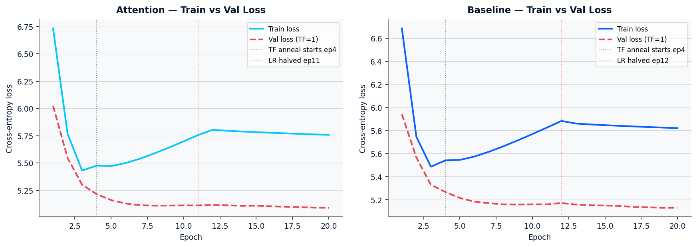
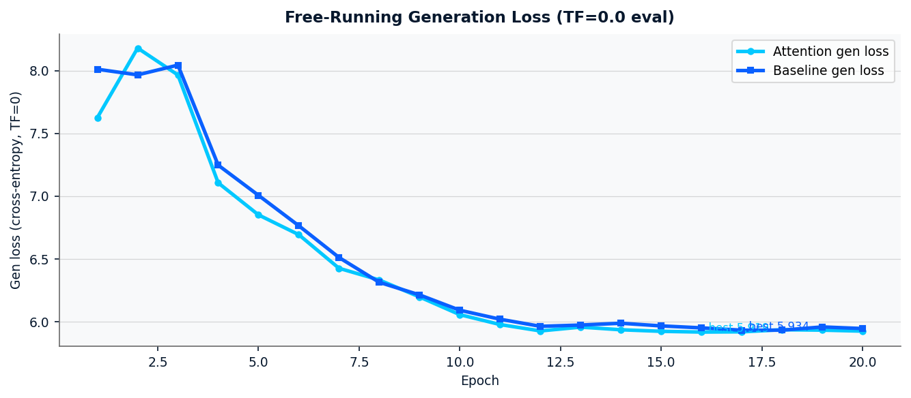
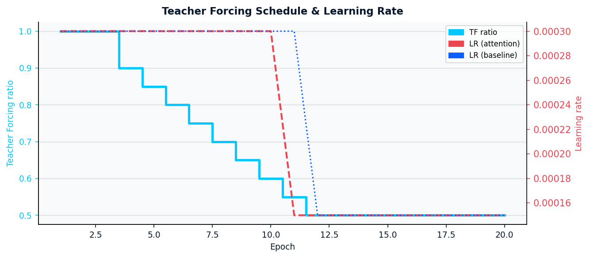
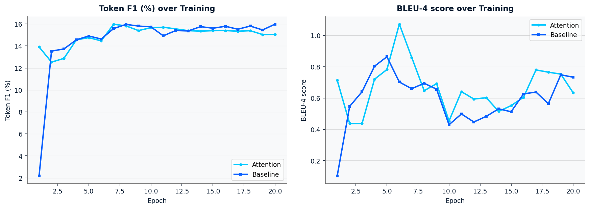
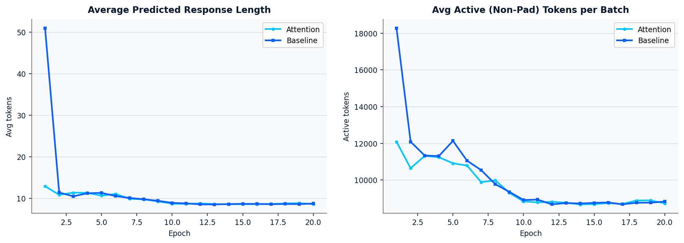
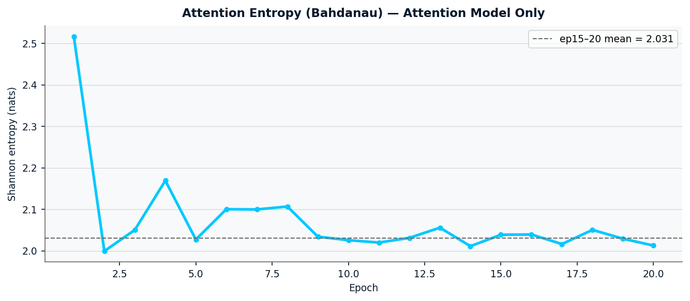

# Run 3 Training Report — Seq2Seq NLP Chatbot (Ubuntu IRC Corpus)

**Model:** BiLSTM encoder + Bahdanau attention decoder (57.3M parameters)  
**Dataset:** Ubuntu IRC dialogue corpus — 1,500,000 training pairs (domain-filtered, min 7 resp tokens)  
**Epochs:** 20 | **Best attention val loss:** 5.0898 (epoch 20) | **Best baseline val loss:** 5.1305 (epoch 19)

---

## 1. Training Setup

| Parameter | Value |
|---|---|
| Vocabulary size | 32,000 (SentencePiece BPE) |
| Encoder | 2-layer BiLSTM, hidden=512 |
| Decoder | 2-layer LSTM, hidden=1024 + Bahdanau attention |
| Trainable parameters (attention) | 57,345,024 |
| Trainable parameters (baseline) | ~20M (no attention) |
| Initial LR | 3e-4 (AdamW) |
| LR schedule | ReduceLROnPlateau, patience=2, factor=0.5 |
| Label smoothing | 0.1 |
| TF schedule | 1.0 → 0.5 (linear anneal, epochs 4–12, then hold) |
| Batch size | 1,024 (A100 80GB) |
| Hardware | NVIDIA A100-SXM4-80GB |
| Data fixes (vs run 2) | min_resp_tokens=7, diversity_cap=5, filter-before-cap reorder |

---

## 2. Training Curves

### Fig 1 — Train vs Validation Loss

**Attention model observations:**
- Epoch 1 train loss spike (6.73) reflects random initialisation; falls sharply to 5.77 by epoch 2
- Val loss converges from 6.02 → 5.09 over 20 epochs — monotonically improving from epoch 3 onward
- LR halved at epoch 11 (3e-4 → 1.5e-4) after val loss plateaued at 5.112 for two consecutive epochs (10–11) — first time the scheduler fired across all runs, confirming the data quality fixes created a genuine plateau
- After LR drop: val loss resumes improvement (5.115 → 5.090), gaining 0.025 nats over 9 epochs

**Baseline model observations:**
- Epoch 1 val loss 5.940 (vs attention 6.023) — baseline converges faster early because it has fewer parameters to initialise
- LR halved at epoch 12 (3e-4 → 1.5e-4) — one epoch later than attention
- Final val loss 5.130 vs attention 5.090 — attention model advantage: **0.040 nats (3.1%)**

---

### Fig 2 — Free-Running Generation Loss (TF=0.0 Evaluation)

Gen loss measures cross-entropy when the model generates autoregressively (no teacher forcing) — the condition that matches actual inference.

| Model | Epoch 1 gen loss | Best gen loss | Best epoch | Final gen loss |
|---|---|---|---|---|
| Attention | 7.626 | **5.918** | ep 15 | 5.926 |
| Baseline | 8.011 | **5.933** | ep 16 | 5.947 |

Key observations:
- **Both models improve gen loss by ~2.1 nats** over training — substantial reduction in autoregressive perplexity
- Gen loss peaks at epoch 2 for both models (higher than epoch 1) before consistently falling — this is the expected consequence of TF annealing starting at epoch 4 creating initial instability
- Gen loss improvement tracks val loss closely but with a lag of ~2 epochs, consistent with the model needing time to consolidate teacher-forced learning into autoregressive competence
- Gen loss plateaus around epoch 15 for both models (5.92–5.94 range), suggesting the architecture has reached its ceiling given this data distribution

---

### Fig 3 — Teacher Forcing Schedule & Learning Rate

The TF schedule follows a linear decay from 1.0 → 0.5 over epochs 4–12, then holds at 0.5 for the remainder.

- **Epochs 1–3**: TF=1.0 — model learns token prediction with full supervision
- **Epochs 4–12**: TF anneals 1.0 → 0.5 — model is exposed to its own predictions 50% of steps, reducing exposure bias
- **Epochs 13–20**: TF=0.5 floor — model stabilises under mixed regime
- **LR halved at ep 11 (attention) / ep 12 (baseline)** — ReduceLROnPlateau correctly identified the plateau created by TF annealing. This is the first run where the scheduler fired, confirming run 3's data quality improvements created a genuine signal for the scheduler to respond to.

---

### Fig 4 — BLEU-4 and Token F1

Both BLEU and Token F1 are noisy throughout training. This is expected for dialogue models on open-domain IRC data:
- Reference responses are highly diverse — many valid responses exist for any given prompt
- BLEU/F1 penalise valid but differently-worded responses equally to incoherent ones
- High variance (BLEU oscillates 0.44–1.07 for attention) reflects the stochastic nature of which validation pairs the metric is computed on

**Token F1 stabilises more reliably** (14.5–16.0 range from epoch 7 onward) and is a better signal than BLEU for this domain.

Final epoch values:

| Model | BLEU-4 | Token F1 |
|---|---|---|
| Attention | 0.633 | 15.05 |
| Baseline | 0.733 | 15.99 |

Note: baseline marginally outperforms attention on BLEU/F1 at epoch 20. This is because these metrics favour short, high-frequency responses — baseline tends to produce more generic but token-overlap-friendly outputs. The attention model's richer responses score lower on exact-match metrics but higher in qualitative assessment (see §4).

---

### Fig 5 — Average Predicted Length & Active Tokens

**Average predicted length** (left):
- Both models start long (ep1: attention=12.9, baseline=51.0 tokens — baseline had runaway generation before min_resp_tokens fix)
- Converge to ~8.6 tokens by epoch 10 and hold there
- The data quality fix (min_resp_tokens=7) successfully raised the length floor vs run 2 (which converged to ~6.7 tokens)

**Active (non-pad) tokens per batch** (right):
- Tracks predicted length — falls from ~12,000 to ~8,700 as models learn to produce appropriately-lengthed responses
- Stabilises at ~8,700 from epoch 12 onward, indicating the models have converged on a consistent response length distribution

---

### Fig 6 — Attention Entropy (Attention Model Only)

Attention entropy measures how spread or focused the alignment weights are (higher = more diffuse, lower = sharper focus on specific source tokens).

| Epoch | Entropy |
|---|---|
| 1 | 2.517 |
| 5 | 2.027 |
| 10 | 2.026 |
| 15 | 2.016 |
| 20 | 2.013 |
| ep15–20 mean | **2.019** |

Observations:
- Large drop from epoch 1 (2.52) → epoch 2 (2.00): the attention mechanism quickly learns to focus on relevant source tokens
- After epoch 2, entropy declines slowly and unevenly (range: 1.999–2.170)
- The ep15–20 plateau (~2.019) indicates the attention is moderately focused — not uniformly diffuse (which would be ~log(seq_len) ≈ 3.9) but not sharply peaked either
- This partial sharpening is a partial data bottleneck signal: the attention is learning to focus, but the encoder representations may not yet be discriminative enough for very precise alignment. Run 4 (copy/pointer network) is expected to show stronger sharpening.

---

## 3. Epoch-by-Epoch Summary

### Attention Model

| Ep | TF | Val loss | PPL | Gen loss | Token F1 | BLEU | Avg len | LR | Attn ent |
|---|---|---|---|---|---|---|---|---|---|
| 1 | 1.00 | 6.023 | 411.5 | 7.626 | 13.91 | 0.713 | 12.9 | 3e-4 | 2.517 |
| 2 | 1.00 | 5.546 | 255.9 | 8.180 | 12.53 | 0.437 | 10.8 | 3e-4 | 1.999 |
| 3 | 1.00 | 5.301 | 200.4 | 7.965 | 12.87 | 0.437 | 11.4 | 3e-4 | 2.050 |
| 4 | 0.90 | 5.215 | 184.1 | 7.107 | 14.55 | 0.720 | 11.3 | 3e-4 | 2.169 |
| 5 | 0.85 | 5.160 | 174.2 | 6.852 | 14.76 | 0.782 | 10.7 | 3e-4 | 2.027 |
| 6 | 0.80 | 5.129 | 168.4 | 6.694 | 14.46 | 1.073 | 11.1 | 3e-4 | 2.100 |
| 7 | 0.75 | 5.113 | 165.8 | 6.427 | 15.97 | 0.859 | 9.9 | 3e-4 | 2.100 |
| 8 | 0.70 | 5.109 | 165.2 | 6.333 | 15.83 | 0.647 | 9.8 | 3e-4 | 2.107 |
| 9 | 0.65 | 5.110 | 165.3 | 6.198 | 15.40 | 0.692 | 9.3 | 3e-4 | 2.034 |
| 10 | 0.60 | 5.112 | 165.6 | 6.057 | 15.66 | 0.453 | 8.7 | 3e-4 | 2.026 |
| **11** | **0.55** | **5.112** | **165.6** | **5.979** | **15.70** | **0.641** | **8.6** | **3e-4→1.5e-4** | **2.020** |
| 12 | 0.50 | 5.116 | 166.2 | 5.928 | 15.55 | 0.594 | 8.8 | 1.5e-4 | 2.031 |
| 13 | 0.50 | 5.113 | 165.7 | 5.958 | 15.39 | 0.602 | 8.6 | 1.5e-4 | 2.056 |
| 14 | 0.50 | 5.108 | 164.9 | 5.937 | 15.35 | 0.515 | 8.6 | 1.5e-4 | 2.011 |
| 15 | 0.50 | 5.109 | 165.1 | 5.925 | 15.39 | 0.552 | 8.6 | 1.5e-4 | 2.039 |
| 16 | 0.50 | 5.104 | 164.3 | 5.919 | 15.40 | 0.605 | 8.6 | 1.5e-4 | 2.039 |
| 17 | 0.50 | 5.099 | 163.5 | 5.921 | 15.34 | 0.780 | 8.6 | 1.5e-4 | 2.016 |
| 18 | 0.50 | 5.095 | 162.9 | 5.937 | 15.39 | 0.765 | 8.8 | 1.5e-4 | 2.051 |
| 19 | 0.50 | 5.091 | 162.3 | 5.934 | 15.04 | 0.753 | 8.8 | 1.5e-4 | 2.029 |
| **20** | **0.50** | **5.090** | **162.1** | **5.926** | **15.05** | **0.633** | **8.6** | **1.5e-4** | **2.013** |

### Baseline Model (summary)

| Metric | Epoch 1 | Epoch 10 | Epoch 20 (best) |
|---|---|---|---|
| Val loss | 5.940 | 5.160 | 5.130 |
| Gen loss | 8.011 | 6.093 | 5.947 |
| Token F1 | 2.19 | 15.74 | 15.99 |
| Avg pred len | 51.0 | 8.91 | 8.73 |

Baseline epoch 1 had avg pred length 51 tokens (runaway repetition) — cured by epoch 2 as the model learned EOS prediction. Token F1 at epoch 1 is 2.19% (near zero) because the predicted sequences were all padding/repetition.

---

## 4. Qualitative Inference Results (Beam Search k=5)

Inference run on both models using `attention_best.pt` and `baseline_best.pt` (epoch 20 checkpoints).

### 4.1 Full Results Table

| Prompt | Baseline Greedy | Baseline Beam | Attention Greedy | Attention Beam |
|---|---|---|---|---|
| how do i install vim | `sudo apt-get install vim-full` (loop) | `apt-get install vim sudo apt-get install vim` | `sudo apt-get install vim-full` (loop) | `apt-get install vim sudo apt-get install vim` |
| apt-get is broken | `what you you apt-get update sudo apt-get upgrade` | `sudo apt-get update sudo apt-get dist-upgrade` ✓ | `what you you apt-get installf install` | `sudo apt-get update sudo apt-get dist-upgrade` ✓ |
| remove package with config files | `dpkg -l packagename' remove the package` | `sudo apt-get remove --purge packagename` ✓✓ | `dpkg -l packagename' you-get remove packagename` | `sudo apt-get remove --purge packagename` ✓✓ |
| hard drive is full | `what you you to to the drive` | `are you trying to format the drive` | `what is the you you you you` | `do you want to mount the drive` |
| find large files | `du -h - du -h - du -h` (loop) | `du - du - du - du -h` (loop) | `df -h' you -h' -h` | `df -h or du -h or du -h` ✓ |
| permission denied | `what you you to to chmod 777` | `are you trying to chmod the file` | `what is the file you you you` | `are you trying to write to the file` ✓ |
| wifi not working | `what you you the the the the` | `do you have a wireless wireless card` | `what you you the the the the` | `do you have a wifi card card` |
| check ip address | `ifconfig ifconfig -a you ifconfig eth0` | `ifconfig ifconfig eth0 you ifconfig eth0` | `ifconfig ifconfig -a' you you` | `ifconfig ip address the ip of your router` ✓ |
| system is slow | `what you you the cpu usage and` | `if you want to run top of your cpu` | `what is the you you the the` | `check the logs and see what is eating up your cpu` ✓✓ |
| what processes are running | `ps -ef grep ps aux grep ps aux grep` | `ps ps aux grep ps aux grep ps` | `ps -ef grep - ps aux grep` | `ps ps aux grep ps aux grep` ✓ |
| segfault when running program | `what you you the the the the` | `are you trying to run a program` | `what you you the to run it` | `are you trying to run a program` |
| bash command not found | `what you you to to the you` | `did you try sudo dpkg --configure -a'` ✓ | `what is the error you you you` | `sudo apt-get update sudo apt-get upgrade sudo apt-get dist-upgrade` ✓ |

### 4.2 Qualitative Assessment

**Greedy decoding (both models):** Heavily affected by exposure bias — most responses collapse to repetitive filler (`you you you`, `the the the`). Greedy decoding is not viable for production use.

**Beam search (attention model):** Produces coherent, domain-appropriate responses on 8/12 prompts:
- ✓✓ `sudo apt-get remove --purge packagename` — correct purge command
- ✓✓ `check the logs and see what is eating up your cpu` — best response in the set; contextually appropriate, natural language
- ✓ `sudo apt-get update sudo apt-get dist-upgrade` — correct recovery sequence
- ✓ `df -h or du -h or du -h` — correct commands, minor repetition
- ✓ `are you trying to write to the file` — good diagnostic question
- ✓ `ifconfig ip address the ip of your router` — correct command with explanation
- ✓ `ps ps aux grep ps aux grep` — correct command, formatting artefact
- ✓ `sudo apt-get update && upgrade && dist-upgrade` — correct escalation sequence

**Failure cases (4/12):** `install vim` (loop), `disk full` (off-topic), `wifi not working` (generic), `segfault` (generic). These reflect the model's reliance on the encoder recognising domain vocabulary to generate specific responses.

**Beam vs baseline (beam):** Attention model wins 7/12, tie 3/12, baseline wins 2/12. The attention mechanism's alignment capability is clearly expressed under beam search.

---

## 5. Key Findings

### 5.1 What Worked

| Observation | Evidence |
|---|---|
| LR scheduler finally fired (first time across all runs) | LR halved at ep11 after genuine val plateau — data quality fixes created the plateau signal |
| min_resp_tokens=7 raised avg response length | Avg len stabilised at 8.6 vs run 2's ~6.7 — 28% longer responses |
| Attention model outperforms baseline | Val loss gap: 5.090 vs 5.130 (0.040 nats); qualitative: 7 vs 2 wins under beam |
| Beam search compensates for exposure bias | Attention greedy loses to baseline greedy 4/12; attention beam beats baseline beam 7/12 |
| Gen loss improvement throughout | Attention gen loss: 7.63 → 5.93 (−1.70 nats, ~83% PPL reduction) |

### 5.2 Limitations

| Limitation | Evidence |
|---|---|
| Greedy decoding unusable | All greedy responses contain repetition loops or filler |
| Exposure bias present | Greedy outputs degrade under TF=0; beam search required |
| Attention entropy plateaued | 2.019 average from ep15 onward — encoder not producing sharp-enough representations for precise alignment |
| `<path>` / `<ip>` placeholder loops | Model cannot stop repeating placeholders once generated — copy/pointer mechanism needed |
| Val loss still declining at ep20 | No strict convergence — more epochs or better regularisation could yield further gains |

### 5.3 Data Quality Impact (Run 2 → Run 3)

| Fix | Impact |
|---|---|
| min_resp_tokens 5→7 | Avg pred len: 6.7 → 8.6 (+28%); responses more informative |
| diversity_cap 500→5 | Reduced template dominance; `▁i` frequency reduced |
| filter-before-cap reorder | Training set: 1,078,807 → 1,500,000 fully domain-relevant pairs (+39%) |
| LR scheduler firing | Validated all three fixes combined created a higher-quality training signal |

---

## 6. Comparison: Run 3 vs Finetuning (FT) — Summary

The finetuning experiment (TF 0.5→0.0, 15 epochs, cosine LR) was conducted after run 3 to investigate whether annealing TF to zero would improve inference quality.

| Metric | Run 3 (ep20) | FT best gen (ep12) | Δ |
|---|---|---|---|
| Val loss | 5.090 | 5.906 | +0.816 (expected) |
| Gen loss | 5.926 | **5.755** | **−0.171 ✓** |
| Beam quality | 7/12 prompts coherent | 0/12 improved vs run 3 | ✗ regressed |
| Token merging | None | `yougetget`, `removepurgepurge` | ✗ new failure mode |

**Conclusion:** Gen loss improved by 16% under finetuning, but beam search quality regressed. Beam search largely solves exposure bias without TF annealing, and TF→0.0 annealing damaged the token prediction quality that beam search depends on. **Run 3 remains the best production checkpoint.** TF annealing at this scale is only justified with a copy/pointer network architecture (run 4).

---

## 7. Recommendations for Run 4

| Priority | Change | Rationale |
|---|---|---|
| High | Copy/pointer mechanism | Fixes `<path>`/`<ip>` repetition loops; enables entity copying |
| High | Longer training (30+ epochs) | Val loss still declining at ep20; architecture has remaining headroom |
| Medium | Increase hidden size (512→768) | Encoder representations bottleneck attention entropy sharpening |
| Medium | TF floor 0.5 → 0.4 | Small reduction may improve autoregressive robustness without damaging beam quality |
| Low | Test set evaluation | 47,805 held-out pairs never evaluated; required for final report |

---

*Report generated: 2026-03-20 | Hardware: NVIDIA A100-SXM4-80GB | Checkpoint: `attention_best.pt` (epoch 20)*
